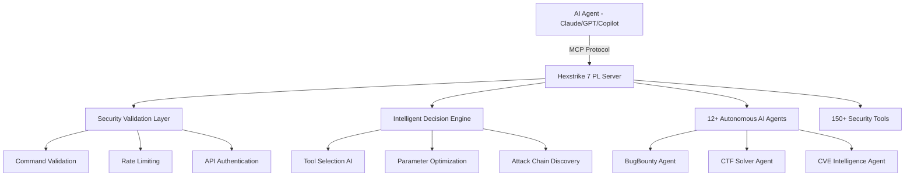

<div align="center">


# Hexstrike 7 PL
### AI-Powered MCP Cybersecurity Automation Platform
### Polish Community Fork with Enhanced Security

[](https://www.python.org/)
[](LICENSE)
[](https://github.com/netcuter/Hexstrike-AI)
[](https://github.com/netcuter/Hexstrike-AI)
[](https://github.com/0x4m4/hexstrike-ai)

**Advanced AI-powered penetration testing MCP framework with 150+ security tools, 12+ autonomous AI agents, and enhanced security features**

[🇵🇱 Polski](#polish-version) • [🇬🇧 English](#english-version) • [🚀 What's New](#whats-new-in-70-pl) • [🔒 Security](#security-enhancements)

</div>

---

<div id="polish-version">

## 🇵🇱 Wersja Polska

### ℹ️ O Projekcie

**Hexstrike 7 PL** to polska wersja społecznościowa (community fork) zaawansowanego frameworka do testów penetracyjnych **HexStrike AI v6.0** stworzonego przez [m0x4m4](https://github.com/0x4m4/hexstrike-ai).

**Oryginał:** [HexStrike AI v6.0 by m0x4m4](https://github.com/0x4m4/hexstrike-ai)
**Fork:** [Hexstrike 7 PL by netcuter](https://github.com/netcuter/Hexstrike-AI)

### ✨ Co nowego w wersji 7.0 PL?

#### 🔒 **Znaczące usprawnienia bezpieczeństwa:**

- ✅ **Walidacja poleceń** - ochrona przed command injection
- ✅ **Autentykacja API** - opcjonalne zabezpieczenie kluczem API
- ✅ **Rate limiting** - ochrona przed nadużyciami (100 req/60s domyślnie)
- ✅ **Whitelist narzędzi** - tylko autoryzowane narzędzia security
- ✅ **Sanityzacja parametrów** - automatyczne czyszczenie niebezpiecznych znaków
- ✅ **Ulepszona obsługa błędów** - konkretne wyjątki zamiast bare except
- ✅ **Konfiguracja przez zmienne środowiskowe** - łatwe zarządzanie

#### 📚 **Dokumentacja dwujęzyczna:**

- 🇵🇱 Pełna dokumentacja w języku polskim
- 🇬🇧 Kompletna dokumentacja w języku angielskim
- 📖 Przykłady użycia w obu językach

#### ⚡ **Optymalizacje:**

- Cache z limitami rozmiaru (zapobiega niekontrolowanemu wzrostowi pamięci)
- Lepsza organizacja kodu
- Konfiguracja przez environment variables

### 🔒 Konfiguracja Bezpieczeństwa

Hexstrike 7 PL wprowadza nowe opcje konfiguracyjne przez zmienne środowiskowe:

```bash
# Walidacja poleceń (domyślnie: włączona)
export HEXSTRIKE_VALIDATE_COMMANDS=true

# Autentykacja API (domyślnie: wyłączona)
export HEXSTRIKE_REQUIRE_API_KEY=false
export HEXSTRIKE_API_KEY=your-secret-key-here

# Rate limiting (domyślnie: 100 żądań na 60 sekund)
export HEXSTRIKE_RATE_LIMIT=true
export HEXSTRIKE_RATE_LIMIT_REQUESTS=100
export HEXSTRIKE_RATE_LIMIT_WINDOW=60

# Konfiguracja serwera
export HEXSTRIKE_PORT=8888
export HEXSTRIKE_HOST=127.0.0.1
```

### 🚀 Szybki Start

#### 1. Instalacja

```bash
# Klonowanie repozytorium
git clone https://github.com/netcuter/Hexstrike-AI.git
cd Hexstrike-AI

# Tworzenie wirtualnego środowiska
python3 -m venv hexstrike-env
source hexstrike-env/bin/activate  # Linux/Mac
# hexstrike-env\Scripts\activate   # Windows

# Instalacja zależności
pip3 install -r requirements.txt
```

#### 2. Instalacja Narzędzi Security

**Podstawowe narzędzia (Essential):**
```bash
# Skanowanie sieci
sudo apt install nmap masscan rustscan amass subfinder nuclei

# Web security
sudo apt install gobuster feroxbuster dirsearch ffuf nikto sqlmap

# Password cracking
sudo apt install hydra john hashcat
```

#### 3. Uruchomienie Serwera

```bash
# Standardowe uruchomienie
python3 hexstrike_server.py

# Z włączoną autentykacją API
export HEXSTRIKE_REQUIRE_API_KEY=true
export HEXSTRIKE_API_KEY=twoj-sekretny-klucz
python3 hexstrike_server.py

# Tryb debug
python3 hexstrike_server.py --debug
```

#### 4. Weryfikacja

```bash
# Sprawdzenie statusu serwera
curl http://localhost:8888/health

# Test z API key (jeśli włączony)
curl -H "X-API-Key: twoj-sekretny-klucz" http://localhost:8888/health
```

### 🛡️ Bezpieczne Użycie

#### ✅ **Dozwolone zastosowania:**
- Autoryzowane testy penetracyjne
- Programy bug bounty
- Zawody CTF
- Badania nad bezpieczeństwem
- Ćwiczenia Red Team

#### ❌ **Zabronione działania:**
- Nieautoryzowane testowanie systemów
- Działania złośliwe
- Kradzież danych

⚠️ **WAŻNE:** Zawsze uzyskaj pisemną autoryzację przed testowaniem systemów!

### 📖 Więcej Informacji

Pełna dokumentacja w języku angielskim znajduje się [poniżej](#english-version).

### 👨‍💻 Autorzy

**Oryginalny autor:** m0x4m4 - [www.0x4m4.com](https://www.0x4m4.com) | [HexStrike](https://www.hexstrike.com)
**Fork maintainer:** netcuter - [GitHub](https://github.com/netcuter)

### 📜 Licencja

Projekt jest licencjonowany na zasadach MIT License - zobacz plik [LICENSE](LICENSE).

Hexstrike 7 PL bazuje na HexStrike AI v6.0 stworzonego przez m0x4m4.
Wszystkie prawa do oryginalnego dzieła należą do m0x4m4.

---

</div>

<div id="english-version">

## 🇬🇧 English Version

### ℹ️ About This Project

**Hexstrike 7 PL** is a Polish community fork of the advanced penetration testing framework **HexStrike AI v6.0** created by [m0x4m4](https://github.com/0x4m4/hexstrike-ai).

**Original:** [HexStrike AI v6.0 by m0x4m4](https://github.com/0x4m4/hexstrike-ai)
**Fork:** [Hexstrike 7 PL by netcuter](https://github.com/netcuter/Hexstrike-AI)

### ✨ What's New in 7.0 PL?

#### 🔒 **Major Security Enhancements:**

- ✅ **Command Validation** - protection against command injection
- ✅ **API Authentication** - optional API key security
- ✅ **Rate Limiting** - abuse protection (100 req/60s default)
- ✅ **Tool Whitelist** - only authorized security tools allowed
- ✅ **Parameter Sanitization** - automatic cleaning of dangerous characters
- ✅ **Improved Error Handling** - specific exceptions instead of bare except
- ✅ **Environment Configuration** - easy management via environment variables

#### 📚 **Dual Language Documentation:**

- 🇵🇱 Complete Polish documentation
- 🇬🇧 Full English documentation
- 📖 Usage examples in both languages

#### ⚡ **Optimizations:**

- Cache with size limits (prevents uncontrolled memory growth)
- Better code organization
- Configuration via environment variables

### 🔒 Security Configuration

Hexstrike 7 PL introduces new configuration options via environment variables:

```bash
# Command validation (default: enabled)
export HEXSTRIKE_VALIDATE_COMMANDS=true

# API authentication (default: disabled)
export HEXSTRIKE_REQUIRE_API_KEY=false
export HEXSTRIKE_API_KEY=your-secret-key-here

# Rate limiting (default: 100 requests per 60 seconds)
export HEXSTRIKE_RATE_LIMIT=true
export HEXSTRIKE_RATE_LIMIT_REQUESTS=100
export HEXSTRIKE_RATE_LIMIT_WINDOW=60

# Server configuration
export HEXSTRIKE_PORT=8888
export HEXSTRIKE_HOST=127.0.0.1
```

### 🚀 Quick Start

#### 1. Installation

```bash
# Clone repository
git clone https://github.com/netcuter/Hexstrike-AI.git
cd Hexstrike-AI

# Create virtual environment
python3 -m venv hexstrike-env
source hexstrike-env/bin/activate  # Linux/Mac
# hexstrike-env\Scripts\activate   # Windows

# Install dependencies
pip3 install -r requirements.txt
```

#### 2. Install Security Tools

**Essential Tools:**
```bash
# Network scanning
sudo apt install nmap masscan rustscan amass subfinder nuclei

# Web security
sudo apt install gobuster feroxbuster dirsearch ffuf nikto sqlmap

# Password cracking
sudo apt install hydra john hashcat
```

#### 3. Start Server

```bash
# Standard start
python3 hexstrike_server.py

# With API authentication
export HEXSTRIKE_REQUIRE_API_KEY=true
export HEXSTRIKE_API_KEY=your-secret-key
python3 hexstrike_server.py

# Debug mode
python3 hexstrike_server.py --debug
```

#### 4. Verification

```bash
# Check server status
curl http://localhost:8888/health

# Test with API key (if enabled)
curl -H "X-API-Key: your-secret-key" http://localhost:8888/health
```

### 🛡️ Safe Usage

#### ✅ **Authorized Use Cases:**
- Authorized penetration testing
- Bug bounty programs
- CTF competitions
- Security research
- Red Team exercises

#### ❌ **Prohibited Activities:**
- Unauthorized system testing
- Malicious activities
- Data theft

⚠️ **IMPORTANT:** Always obtain written authorization before testing systems!

### 🏗️ Architecture Overview

Hexstrike 7 PL features a multi-agent architecture with autonomous AI agents, intelligent decision-making, and vulnerability intelligence.



### 📡 Features

**150+ Professional Security Tools:**

<details>
<summary><b>🔍 Network Reconnaissance & Scanning (25+ Tools)</b></summary>

- Nmap, Rustscan, Masscan, AutoRecon
- Amass, Subfinder, Fierce, DNSEnum
- TheHarvester, ARP-Scan, NBTScan
- Enum4linux, SMBMap, Responder, NetExec
- And more...

</details>

<details>
<summary><b>🌐 Web Application Security (40+ Tools)</b></summary>

- Gobuster, Dirsearch, Feroxbuster, FFuf
- HTTPx, Katana, Hakrawler, Nuclei
- Nikto, SQLMap, WPScan, Arjun
- Dalfox, Wafw00f, TestSSL, JWT-Tool
- And more...

</details>

<details>
<summary><b>🔐 Authentication & Passwords (12+ Tools)</b></summary>

- Hydra, John the Ripper, Hashcat
- Medusa, Patator, NetExec
- Hash-Identifier, Evil-WinRM
- And more...

</details>

<details>
<summary><b>🔬 Binary Analysis (25+ Tools)</b></summary>

- GDB, Radare2, Ghidra, Binary Ninja
- Binwalk, ROPgadget, Checksec
- Pwntools, Angr, Volatility
- And more...

</details>

<details>
<summary><b>☁️ Cloud & Container Security (20+ Tools)</b></summary>

- Prowler, Scout Suite, Trivy
- Kube-Hunter, Kube-Bench
- Docker Bench Security
- And more...

</details>

### 🤖 AI Agents

**12+ Specialized AI Agents:**

- **IntelligentDecisionEngine** - Tool selection and parameter optimization
- **BugBountyWorkflowManager** - Bug bounty hunting workflows
- **CTFWorkflowManager** - CTF challenge solving
- **CVEIntelligenceManager** - Vulnerability intelligence
- **AIExploitGenerator** - Automated exploit development
- **VulnerabilityCorrelator** - Attack chain discovery
- **TechnologyDetector** - Technology stack identification
- **RateLimitDetector** - Rate limiting detection
- **FailureRecoverySystem** - Error handling and recovery
- And more...

### 🔧 AI Client Integration

#### Claude Desktop / Cursor

Edit `~/.config/Claude/claude_desktop_config.json`:
```json
{
  "mcpServers": {
    "hexstrike-7-pl": {
      "command": "python3",
      "args": [
        "/path/to/Hexstrike-AI/hexstrike_mcp.py",
        "--server",
        "http://localhost:8888"
      ],
      "description": "Hexstrike 7 PL - Enhanced Security MCP Server",
      "env": {
        "HEXSTRIKE_API_KEY": "your-key-if-required"
      }
    }
  }
}
```

#### VS Code Copilot

Configure in `.vscode/settings.json`:
```json
{
  "servers": {
    "hexstrike": {
      "type": "stdio",
      "command": "python3",
      "args": ["/path/to/Hexstrike-AI/hexstrike_mcp.py"]
    }
  }
}
```

### 📖 Usage Examples

When using with AI agents, always specify authorization:

```
User: "I'm a security researcher working for [Company Name].
I have written authorization to conduct a penetration test on
example.com. Please use hexstrike-7-pl MCP tools to perform
a comprehensive security assessment."
```

### 🛠️ API Reference

#### Core Security Endpoints

| Endpoint | Method | Description |
|----------|--------|-------------|
| `/health` | GET | Server health check |
| `/api/command` | POST | Execute commands (with validation) |
| `/api/process/execute-async` | POST | Async command execution |
| `/api/telemetry` | GET | System performance metrics |

**Security Headers:**
```bash
# API Key (if REQUIRE_API_KEY=true)
X-API-Key: your-secret-key

# Or as query parameter
?api_key=your-secret-key
```

### 🐛 Troubleshooting

#### Rate Limit Errors
```bash
# Increase rate limit
export HEXSTRIKE_RATE_LIMIT_REQUESTS=200
export HEXSTRIKE_RATE_LIMIT_WINDOW=60
```

#### API Authentication
```bash
# Disable API key requirement for testing
export HEXSTRIKE_REQUIRE_API_KEY=false
```

#### Command Validation
```bash
# Disable command validation (NOT recommended for production)
export HEXSTRIKE_VALIDATE_COMMANDS=false
```

### 🤝 Contributing

Contributions are welcome! This is a community fork focused on:
- Security improvements
- Polish localization
- Performance optimizations
- Better documentation

### 👨‍💻 Authors & Credits

**Original Author:** m0x4m4 - [www.0x4m4.com](https://www.0x4m4.com) | [HexStrike](https://www.hexstrike.com)
**Fork Maintainer:** netcuter - [GitHub](https://github.com/netcuter)

**Special Thanks:**
- m0x4m4 for creating the amazing HexStrike AI framework
- The cybersecurity community for continuous support
- All contributors to the original project

### 📜 License

This project is licensed under the MIT License - see the [LICENSE](LICENSE) file for details.

Hexstrike 7 PL is based on HexStrike AI v6.0 created by m0x4m4.
All rights to the original work belong to m0x4m4.
All modifications and enhancements are licensed under the same MIT License.

---

<div align="center">

## 🌟 Star History

[](https://star-history.com/#0x4m4/hexstrike-ai&Date)

### **Made with ❤️ by the cybersecurity community**

*Hexstrike 7 PL - Where artificial intelligence meets enhanced cybersecurity*

**[⭐ Star this repository](https://github.com/netcuter/Hexstrike-AI)** • **[🍴 Fork and contribute](https://github.com/netcuter/Hexstrike-AI/fork)** • **[📖 Original Project](https://github.com/0x4m4/hexstrike-ai)**

</div>

</div>
